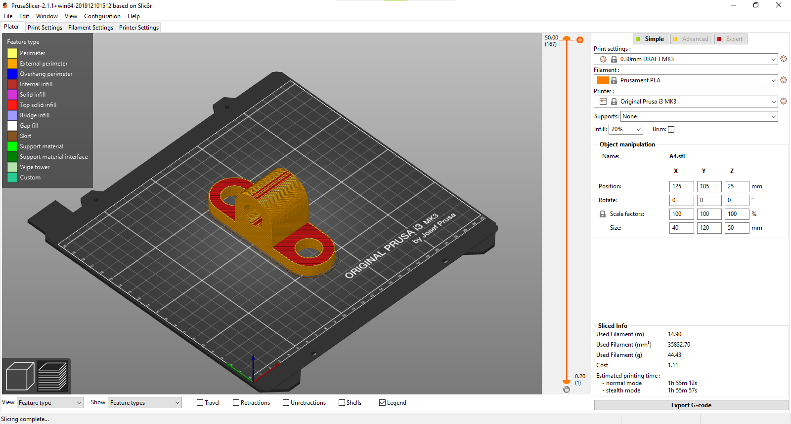

# Homework #2

## Tasks:
1. Download a model from Thingiverse and modify it. Slice it for 3D printing
and make a screenshot of the slicer window with the sliced object and the
selected option. Think of an useful improvement. If you’re happy with the
new design, upload it as a remix of the original.
### Panther keychain

2. Model model A1(following the lab video tutorials), A2, A3, A4(following the
lab video tutorials) you can find the isometric schemes at [this link](https://drive.google.com/drive/folders/1XKvajzrTkdgdxZ_gibBK8fPAChzNmGnM)
### A1

### A2

### A3

### A4

