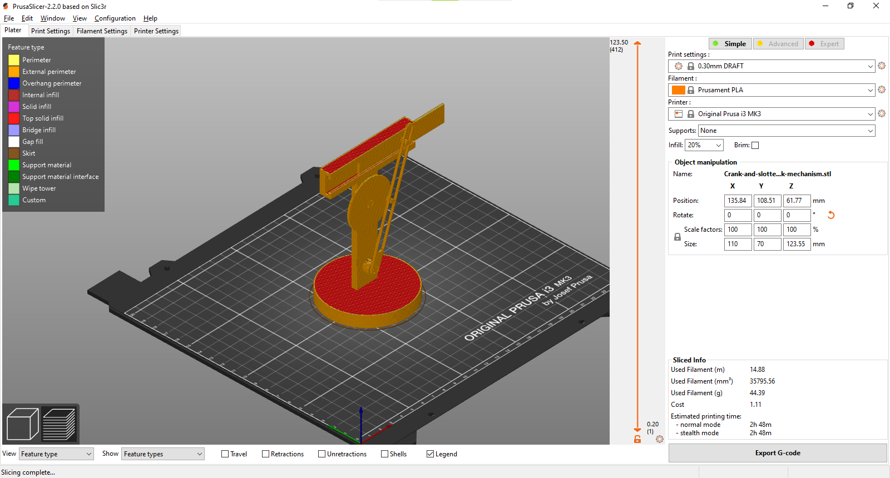
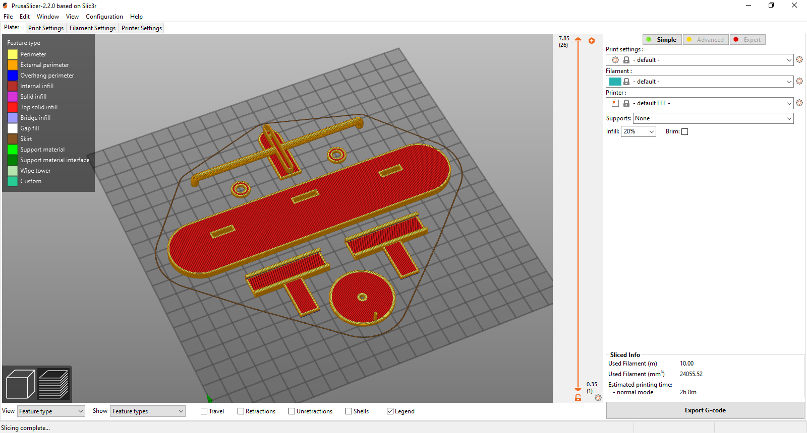
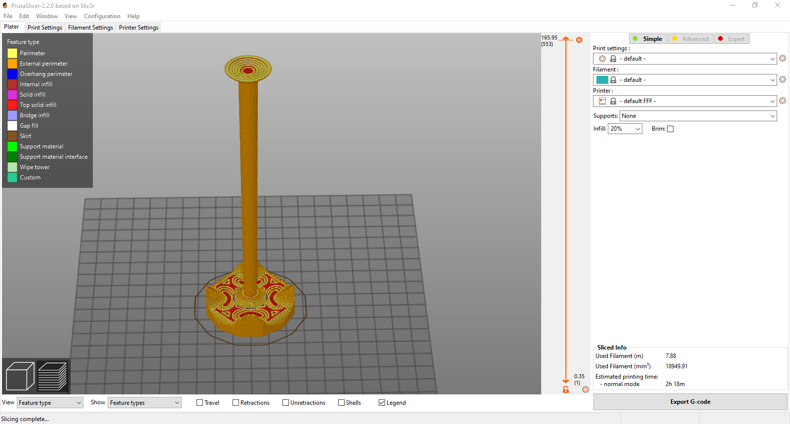

# Homework #4

## Tasks:
1. Watch and understand the courses videos about Rotational to Linear Motion and Vice-Versa mechanisms (We recommend to model them on your own as well)

2. Design the [Scotch Yoke Mechanism](https://www.youtube.com/watch?v=HhX-8RyP214) taking the course videos as reference (especially the slider crank mechanism; in this one can see why it’s important to use Fusion Rule Number 1)

  a. Divide the mechanism into components

  b. Use Fusion Rule Number 1

  c. Design the model having in mind that it will be 3D printed

  d. Rename your bodies, components, sketches, etc

  e. Add appearances

  f. Add joints

  g. Create a motion study

  3. Create a scene with a twisted column on a polygon surface (Fig. 3.1)

  a. Use polygons tool to create the base (3DMP Lab #5.1)

  b. Replace the top face of the base with a custom surface to create the specific landscape for the column (3DMP Lab #5.5)

  c. Create a twisted column (Fig. 3.2). Use sweep for the body of the column (3DMP Lab #5.4) and loft for it’s bottom and top part (3DMP Lab #5.2 and 3DMP Lab #5.3)

  d. Add appearance on the model, render it, and make a photo of the render (3DMP Course #3.9 and 3DMP Course #3.10)

