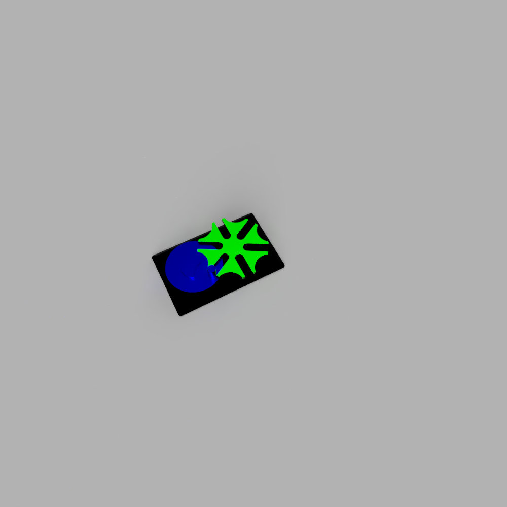
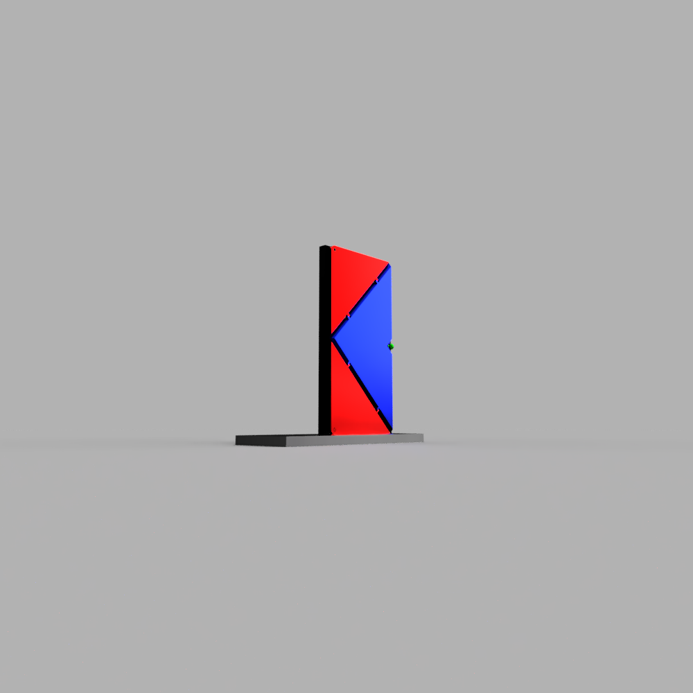

# Homework #5

## Tasks:
1. Choose a mechanism from the next list and design it in Fusion:
[a](https://tinyurl.com/y8zgkzjq) [b](https://tinyurl.com/ycxhnskp) [c](https://tinyurl.com/ycc3mrls) [d](https://tinyurl.com/ybxq84ko) [e](https://tinyurl.com/y9uww3b8) [f](https://tinyurl.com/y94sx6om) [g](https://tinyurl.com/y7jvyma3) [h](https://tinyurl.com/ydabljd6)

2. Divide the mechanism into components

3. Use Fusion Rule Number 1

4. Use suggestive names for any element that you include in your project

5. Create a stand for the mechanism 

6. Add joints and create a motion study

7. Add appearances and render the mechanism

BONUS: Design the evolution door following 2-7 steps from the homework tasks.
You can choose one from the next two versions:

[Version 1](https://tinyurl.com/yatsz26w) [Version 2](https://tinyurl.com/y7swh4cp)

